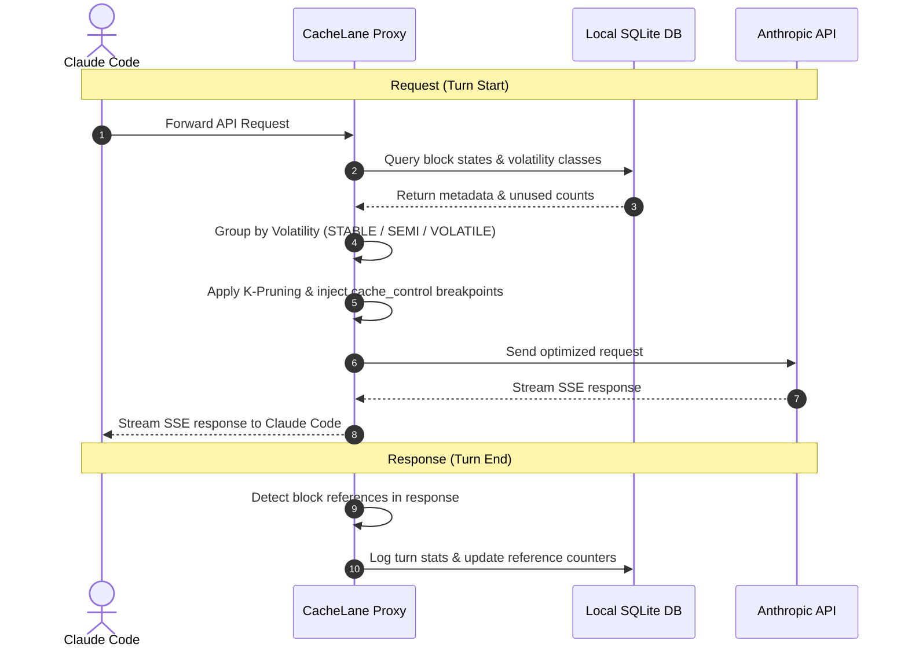
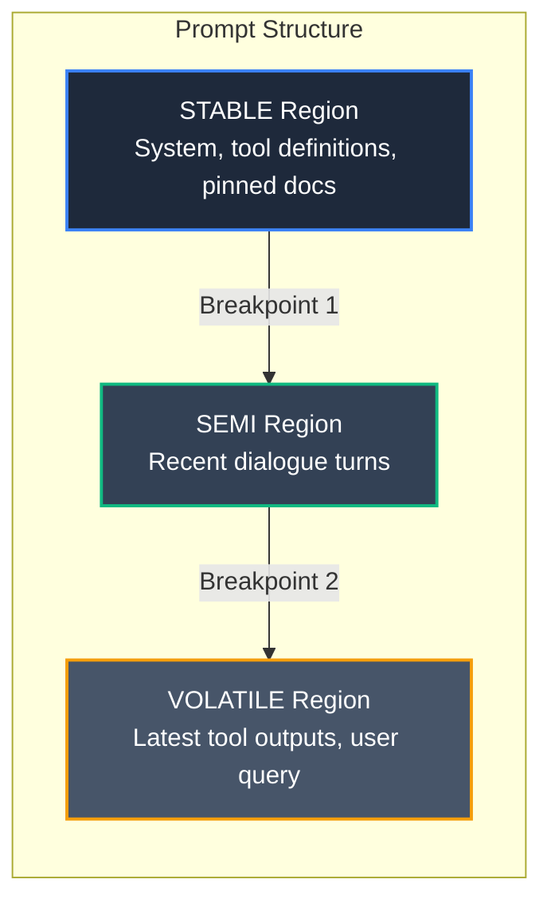
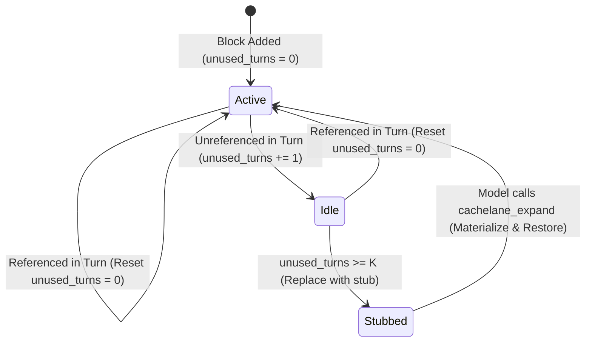

# CacheLane

[](https://cache-lane.vercel.app/)
[](https://nodejs.org)
[](LICENSE)

> **A local cache-discipline layer for Claude Code.**
>
> CacheLane sits between Claude Code and `api.anthropic.com` and marks cache breakpoints on the unchanging prefix, then prunes stale tool output. The **target** on long Anthropic sessions is **30% to 60%** lower input-token cost — a design goal, not a live measurement on this host — with **zero change to how you use Claude Code**.
>
> 🌐 **Website:** [cache-lane.vercel.app](https://cache-lane.vercel.app/)

<video src="https://github.com/Aditya-Tripuraneni/CacheLane/raw/main/web/public/cachelane.mp4" width="100%" controls autoplay loop muted></video>

---

## Quickstart

```bash
# 1. Install the CLI
npm install -g cachelane

# 2. Wire it into Claude Code (idempotent, safe to re-run)
cachelane install

# 3. Restart Claude Code so it picks up the new settings
```

**That's it.** You don't start a server, run a proxy, or change any commands. After the restart, CacheLane intercepts and optimizes every turn automatically.

> ⚠️ **Do not run `cachelane proxy` yourself.** The proxy is started *for you* (see [How it works](#how-it-works)). Running it manually collides on port 7332 and crashes with `EADDRINUSE`.

### Verify it's working

```bash
cachelane doctor                  # health check: node, config, db, mcp, hooks
cachelane sessions                # list recorded sessions + observed provider reuse / estimated savings
cachelane stats --scope session   # stats for the current project's latest session
```

Run `cachelane stats` **from your project directory**. It scopes to that project automatically (see [Reading your stats](#reading-your-stats)).

---

## Why it saves money

The Claude API is stateless, so Claude Code re-sends the whole conversation
every turn. CacheLane **marks** (does not reorder) the unchanging prefix with
`cache_control` breakpoints so Anthropic can serve it at 0.1×, then stubs idle
tool output. Full intuition, pricing table, K-pruning, and keepalive:

→ [`docs/why-it-saves-money.md`](docs/why-it-saves-money.md)

## How it works

`cachelane install` makes two edits to your Claude Code configuration:

1. **Registers an MCP server** in `~/.claude.json` (`mcpServers.cachelane`). Claude Code launches `cachelane mcp` automatically every time it starts.
2. **Redirects API traffic** by setting `ANTHROPIC_BASE_URL=http://127.0.0.1:7332` in `~/.claude/settings.json`. This is what routes Claude Code's requests through CacheLane.

The `cachelane mcp` process does **two jobs in one process**:

- Exposes MCP tools to Claude (`cachelane_stats`, `cachelane_explain`, `cachelane_expand`, `cachelane_retrieve_tool_output`, `cachelane_health`).
- Because `auto_proxy` is on by default, it **also starts the HTTP proxy** on `127.0.0.1:7332` in the same process.

So a single auto-launched process owns everything. That's why you never start anything by hand, and why running `cachelane proxy` separately would fight it for the port.

For each turn the proxy:

1. Intercepts the outgoing request from Claude Code.
2. Runs the pipeline (**compress tool outputs → classify → prune → place `cache_control` breakpoints**) — measured at **< 35 ms p95** per turn, with compression benchmarked separately.
3. Forwards the optimized request to `api.anthropic.com` and streams the response straight back.
4. Logs metadata (hashes, token counts, hit ratios) to local SQLite.

If the **pre-forward pipeline** throws (classify / prune / mutate), the proxy forwards the original request ([Fail-open guarantees](#fail-open-guarantees)). Startup, upstream, and mid-stream failures cannot transparently fail open. The three mechanisms are explained in [Why it saves money](docs/why-it-saves-money.md).

---

## Reading your stats

CacheLane records every turn under a **workspace** derived from the directory Claude Code was launched in, plus the Claude Code **session id**. `cachelane stats` mirrors that:

- `cachelane stats`: all sessions for the current project (workspace scope, the default).
- `cachelane stats --scope session`: the most recent session **in the current project** (run it from your project dir). With no `--session-id`, it auto-selects the latest session.
- `cachelane stats --scope workspace`: all sessions for the current project.
- `cachelane stats --scope all`: everything, across all projects.
- `cachelane sessions`: a table of every recorded session with observed provider cache reuse and estimated provider input-cost savings, across all projects.

Most of the time you won't need flags. Just run `cachelane stats` from your project directory. To target a specific session explicitly (for example one from another project), pass its id from `cachelane sessions`:

```bash
cachelane stats --scope all --session-id <session-id>
```

Sessions are keyed by Claude Code's own session id, so the value in the `cachelane sessions` table is exactly what `--session-id` expects.

For the local dual-lane installation, run `node scripts/stats-dual.mjs`. Treat its `token_reuse_index` as a provider-normalized reuse ratio, not USD savings. LiteLLM's OpenAI-style cached-token fields may reflect provider automatic caching; they do not prove CacheLane's Anthropic marker planner is effective. Controlled Claude conformance and three-arm measurement procedures are in [`docs/runbook-claude-effectiveness.md`](docs/runbook-claude-effectiveness.md).

Historical Claude hook telemetry rows are **not** automatically rewritten by the telemetry remediation fixes in this branch (transcript nested/legacy cache-creation tier parsing, honest hook outcome signals, and non-attribution stats labels). Those fixes apply only to **new** ingestion after the remediated runtime is installed (installed `/srv/cachelane/GIT_SHA` matches the remediated repository HEAD). A safe, human-authorized exact-match repair procedure for already-persisted rows (preview, backup, transaction, invariants, rollback) is documented in [`docs/operations/cachelane-hook-stats-repair.md`](docs/operations/cachelane-hook-stats-repair.md). That runbook does not claim historical data has already been repaired.

### Per-block cost attribution (`explain --top-blocks`)

`cachelane stats` shows aggregate savings, but it doesn't tell you *which blocks* are eating your budget. The `--top-blocks` flag on `explain` breaks that down:

```bash
cachelane explain --top-blocks        # top 10 blocks by token weight (default)
cachelane explain --top-blocks 5      # top 5
cachelane explain --turn 3 --top-blocks 20   # specific turn, top 20
```

Sample output:

```
Turn 42 — Top blocks by token weight

  Block ID                                Kind            Region      Tokens  Tier              Est. Cost
  ──────────────────────────────────────────────────────────────────────────────────────────────────
  block-2-file1                           file_read       STABLE       15000  cache_read        1500.0 cu
  block-3-file2                           file_read       SEMI          8500  cache_creation_5m  10625.0 cu
  block-6-tool2                           tool_output     VOLATILE      4500  input (1x)        4500.0 cu
  block-1-system                          system_prompt   STABLE        4000  cache_read        400.0 cu
  block-4-tool                            tool_output     SEMI          3200  cache_creation_5m  4000.0 cu
  block-5-user                            user_message    VOLATILE        50  input (1x)        50.0 cu

  Region totals:
    STABLE  :    19000 tokens → cache_read         (0.1x)     →  1900.0 cu
    SEMI    :    11700 tokens → cache_creation_5m  (1.25x/2x) → 14625.0 cu
    VOLATILE:     4550 tokens → input              (1x)       →  4550.0 cu
    Total effective: 21075.0 cu  (vs. 35250.0 baseline — 40.2% savings)
```

Each block shows:

- **Region**: which volatility bucket (STABLE / SEMI / VOLATILE) the block landed in.
- **Tier**: the reconciler's **assigned** tier for that block (`cache_read` / `cache_creation_5m` / `cache_creation_1h` / `input`) — not a per-block field from the API.
- **Est. Cost**: token count × tier multiplier, in cost units.

The **session totals** come from the API `usage` object. The **per-region / per-block split** is an estimate from the reconciler — do not treat a block's “Tier” column as a provider invoice line.

**How it works under the hood:**

1. On each turn, the proxy tokenizes every block using Anthropic's tokenizer (with an in-memory cache keyed by `content_hash` so identical blocks are never re-tokenized).
2. After the API response arrives, a **reconciler** (`src/reconciler/index.ts`) **distributes the authoritative `usage` token counts** across regions. Matching breakpoint hashes are a *heuristic* for which region might have been a cache read — they do **not** prove a provider cache hit (TTL expiry or eviction can still produce `cache_creation` in `usage`). VOLATILE is assigned leftover `input` tokens.
3. The reconciled `RegionCostBreakdown` is stored in `region_cost_json` on the `turn_explanations` table. Totals follow `usage`; per-region split is estimated.

---

## Command reference

### Everyday commands

| Command | Purpose |
|---------|---------|
| `cachelane install` | Register the MCP server + hooks and redirect Claude Code traffic through the proxy. Idempotent. |
| `cachelane uninstall [--purge]` | Remove the integration. `--purge` also deletes `~/.cachelane` (config + database). |
| `cachelane doctor [--json]` | Health check: Node version, config, SQLite writability, MCP + hook registration. |
| `cachelane stats [--scope session\\|workspace\\|all] [--json]` | Telemetry records, observed provider cache reuse, pruned blocks, and estimated provider input-cost savings. |
| `cachelane sessions [--json]` | List all recorded sessions with observed provider cache reuse and estimated provider input-cost savings. |
| `cachelane report [--scope session\\|workspace\\|all]` | Generate and open a self-contained HTML dashboard webpage of your savings. |
| `cachelane explain [--turn <N>] [--top-blocks [N]] [--json]` | Show how CacheLane classified and pruned blocks, and where it placed cache breakpoints, for a turn. `--top-blocks` ranks blocks by token cost. |
| `cachelane config` | Print the active configuration. |

### Tuning

| Command | Purpose |
|---------|---------|
| `cachelane prune --default \| --aggressive \| --conservative` | Set the K-pruning threshold (`K=3`, `K=2`, or `K=5`). |
| `cachelane keepalive off \| static \| adaptive \| auto` | Configure cache-TTL keepalive behavior. |
| `cachelane pin <file\|glob>` | Pin files into the `STABLE` region so they're never pruned. |
| `cachelane exclude <file\|glob>` | Exclude files from cache-aware classification. |
| `cachelane enable` / `cachelane disable` | Toggle pruning without uninstalling. |
| `cachelane enable-compression` / `cachelane disable-compression` | Toggle tool-output compression globally. |
| `cachelane compression-mode lossless\|balanced\|aggressive` | Set compression mode. `lossless` is the default; `balanced` and `aggressive` are lossy. |
| `cachelane exclude-compression <tool_use_id\|glob>` | Exclude matching tool outputs from compression. |
| `cachelane compression-compressor json\|log enable\|disable` | Toggle a specific compressor while leaving the rest enabled. |
| `cachelane compression-retention enable\|disable` | Toggle local original-output retention for retrievable lossy compression. Disabled by default. |

### Internal / advanced

These are run for you or are for debugging; you normally never invoke them:

| Command | Purpose |
|---------|---------|
| `cachelane mcp` | The MCP + proxy server. **Auto-started by Claude Code.** Do not run it manually. |
| `cachelane proxy [--port]` | Standalone proxy, for setups *not* using the MCP server. Collides with the auto-started proxy if both run. |
| `cachelane debug pruner [--limit <N>]` | Dump recent pruner debug entries as JSON. |
| `cachelane benchmark dashboard` | Open a live terminal TUI dashboard to view real-time savings. |
| `cachelane benchmark latency` | Live TTFT A/B test (CacheLane proxy vs raw direct) to measure speed. |
| `cachelane benchmark duel` | Run CacheLane ON vs OFF on recorded scenarios and emit a comparison report. |
| `cachelane benchmark <compare\\|correctness\\|live-report\\|ab-test>` | Suite of tools for offline trace comparisons, rehydration recall, and testing. |
| `cachelane hook <name>` | Claude Code hook entrypoint (records turn stats in hook mode). |

### MCP tools (exposed to Claude)

When the server is running, Claude can call:

- `cachelane_stats`: session/workspace cache and savings aggregates.
- `cachelane_explain`: structured explanation of region breakpoints and prune decisions.
- `cachelane_expand`: restore a pruned stub's full content into the next turn.
- `cachelane_retrieve_tool_output`: retrieve a locally retained original tool output by handle when compression retention is enabled.
- `cachelane_health`: health status and degraded-fallback metrics.

---

## Configuration

Settings live in `~/.cachelane/config.json` and can be edited via the tuning commands above. Defaults:

| Setting | Default |
|---------|---------|
| Pruner | enabled, `K=3` |
| Keepalive | `auto` (ping every ~2.5 min after ~4 min idle; 1-hour TTL tier above 50k-token prefixes) |
| Proxy | `127.0.0.1:7332`, upstream `api.anthropic.com:443` |
| Auto-proxy | on (MCP server starts the proxy in-process) |
| Telemetry | **off** (opt-in only) |
| Compression | enabled, mode `lossless`; JSON, log, **and shell** compressors on (`src/config/defaults.ts`) |
| Compression retention | **off** (opt-in local storage of original tool outputs) |

---

## Chaining with another proxy (e.g. a token optimizer)

CacheLane is compatible with another local proxy in front of `api.anthropic.com` — you **chain** them rather than choosing one. CacheLane's upstream is configurable (it is *not* hardcoded to Anthropic): set `proxy.upstream_host` / `upstream_port` / `upstream_ssl` / `upstream_path_prefix` in `~/.cachelane/config.json`. Run `cachelane config` to print the active values.

**Put CacheLane *last*, immediately before Anthropic.** Its entire benefit comes from arranging blocks and placing `cache_control` breakpoints so the Anthropic prompt cache fires at 0.1×. That depends on the *exact bytes Anthropic receives* being the ones CacheLane arranged — so CacheLane should be the hop that talks to Anthropic. Any proxy that rewrites the body *after* CacheLane can shift or invalidate those breakpoints and defeat the cache.

```
Claude Code  ──►  Other proxy (:8787)  ──►  CacheLane (:7332)  ──►  api.anthropic.com
```

- Keep `ANTHROPIC_BASE_URL=http://localhost:8787` pointed at the other proxy.
- Point the **other proxy's** upstream at CacheLane (`http://localhost:7332`) instead of directly at Anthropic.
- Leave CacheLane's upstream at the default (`api.anthropic.com`).

**If the other proxy can't be repointed** (only Claude Code's base URL is configurable), chain it the other way and set CacheLane's upstream to that proxy:

```
Claude Code  ──►  CacheLane (:7332)  ──►  Other proxy (:8787)  ──►  api.anthropic.com
```

- Set `ANTHROPIC_BASE_URL=http://localhost:7332`.
- In `~/.cachelane/config.json`, set `proxy.upstream_host: "127.0.0.1"`, `proxy.upstream_port: 8787`, `proxy.upstream_ssl: false` (a local proxy is typically plain HTTP).
- Caveat: the other proxy is now the last hop and may mutate the body, which can disturb CacheLane's `cache_control` placement and reduce the realized cache savings.

**Caveats when stacking two token-reduction layers:** they may overlap or interact (e.g. one stripping content the other expects to stub/refetch). Verify with `cachelane stats` that you're still seeing cache reads and reduction after chaining.

**Verify the chain is healthy:** after wiring two proxies together, run `cachelane doctor --probe` to confirm CacheLane's configured upstream is reachable and that cache reads are still firing. If `cache_reads` warns that reads dropped to ~0, the other layer may be stripping content CacheLane needs to cache — see the caveats above.

> Prefer the MCP-launched proxy (leave `auto_proxy` on) and only change `ANTHROPIC_BASE_URL` / `proxy.upstream_*`. Start `cachelane proxy` yourself only when you are **not** using `cachelane mcp`; two listeners on `:7332` is `EADDRINUSE`.

---

## Files & data storage

All state is local:

| Path | Contents |
|------|----------|
| `~/.cachelane/config.json` | Configuration |
| `~/.cachelane/cachelane.db` | SQLite log: block hashes, token counts, hit stats, and optional retained tool-output originals when compression retention is enabled |
| `~/.cachelane/cachelane.log` | Rotating log (10 MB × 5 files) |
| `~/.claude.json` | MCP server registration (`mcpServers.cachelane`) |
| `~/.claude/settings.json` | `ANTHROPIC_BASE_URL` redirect + hook entries |
| `~/.claude/hooks/cachelane.json` | Hook marker (read by `cachelane doctor`) |

---

## Security & privacy (100% local-first)

- **No SaaS backend.** No prompt text, responses, or file contents leave your machine except directly to `api.anthropic.com` over TLS.
- **Metadata-only by default.** The database stores block hashes, token counts, and hit statistics. If compression retention is explicitly enabled, it can also store original tool outputs locally until expiry for retrieval.
- **Opt-in telemetry.** Disabled by default. If enabled, it reports only high-level aggregates (cache ratios, savings) and strips paths, prompt text, workspace IDs, and keys.

---

## Fail-open guarantees

If classify / prune / mutate throws **before** the upstream request is sent, the proxy logs to `$CACHELANE_HOME/cachelane.log` and forwards the **unmodified** body (`src/proxy/server.ts` fail-open catch). That does **not** cover: the process failing to start (Node mismatch, `EADDRINUSE`), the upstream being down, or an error after SSE bytes have already been emitted — those cannot replay transparently.

CacheLane also enforces a **cache-stability gate**: the SHA-256 of the orchestrated prefix region must be byte-identical across repeated identical-input runs, preventing cache-busting drift from timestamps, random seeds, or unordered fields.

---

## For contributors

### Build from source

```bash
git clone https://github.com/Aditya-Tripuraneni/CacheLane.git
cd CacheLane
npm install
npm run build
npm link        # exposes the `cachelane` command from your local build
```

### Tests & checks

> **Node version:** Node **22 or newer** is required. Development and CI cover Node 22
> and Node 24 LTS; the SQLite native dependency is pinned to a release line with
> prebuilt bindings for both.

```bash
npm test            # vitest run (full suite)
npm run lint        # eslint
npx tsc --noEmit    # typecheck
npm run doctor:ci   # CI-friendly install/health check
```

### Deterministic benchmark harness

Audit savings locally without spending API credits. This replays pre-recorded sessions:

```bash
npm run benchmark:recorded
```

It reports baseline vs. effective cost units and the resulting savings ratio; output is written under `benchmark/runs/`.

---

## Architecture diagrams

### Interception lifecycle



### Orchestrated prompt layout



### K-Pruning state diagram



---

## License

[Apache-2.0](LICENSE)

## This host (fleet install)

`npm install -g` + `cachelane install` is the single-user Claude Code path
(default `:7332`, `auto_proxy` on). This machine also runs dual systemd units
from `/srv/cachelane`: Claude Code → `:7333` → Anthropic; Pi → `:7332` → LiteLLM.
Do not collapse those surfaces. [`docs/README.md`](docs/README.md),
[`docs/operations/production-install.md`](docs/operations/production-install.md),
[`docs/operations/lane-state.md`](docs/operations/lane-state.md).
`cachelane --version` prints `0.0.1` even when `package.json` is `1.1.7`.

## Knowledge

[`.okf/index.md`](.okf/index.md) catalogs structured knowledge.
Operator + history routing: [`docs/README.md`](docs/README.md).
